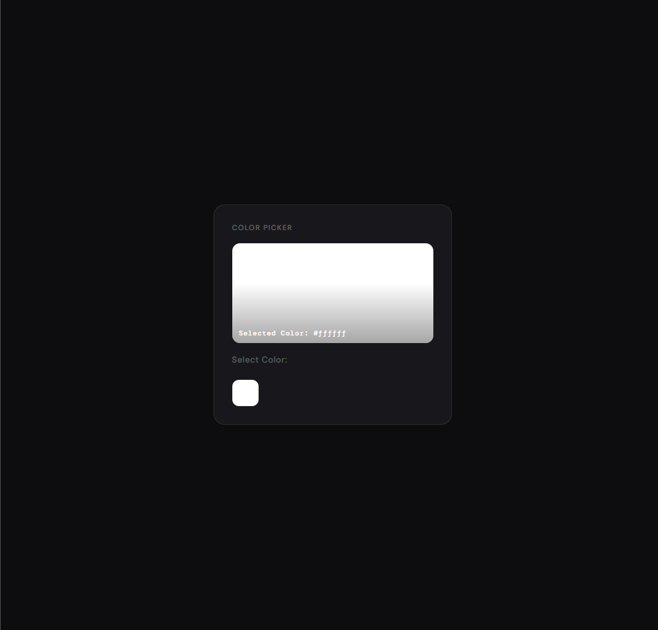
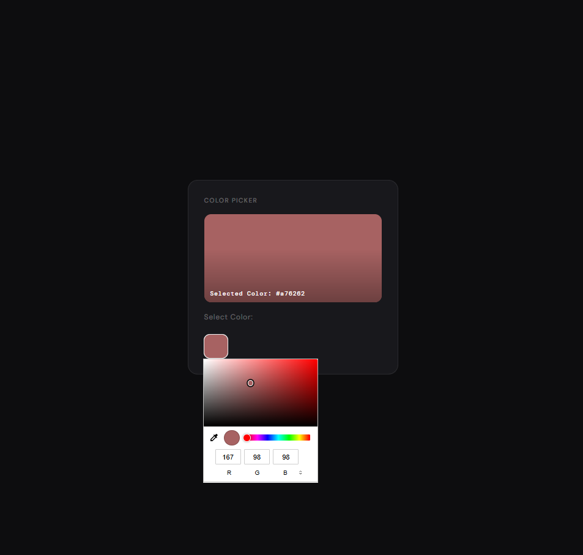
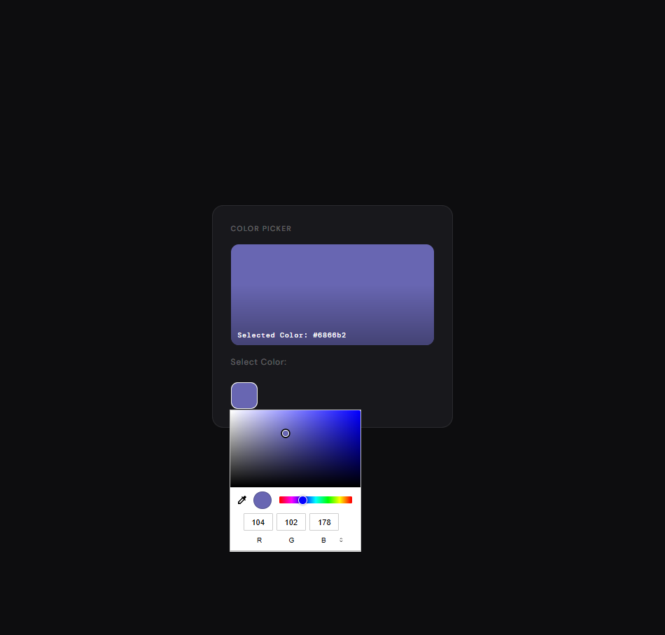
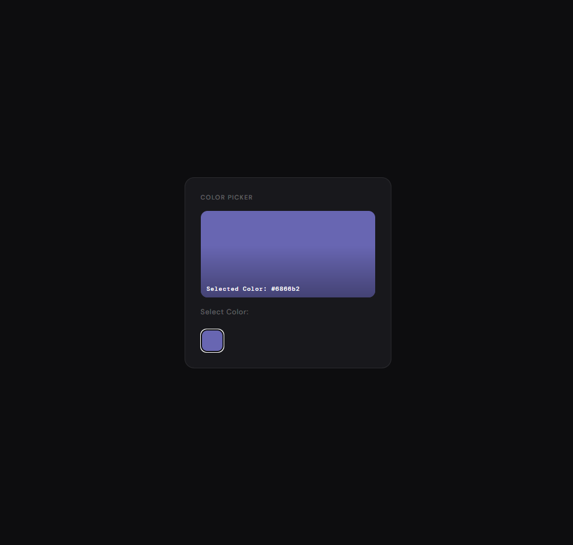

# <!-- Improved compatibility of back to top link -->

<a id="readme-top"></a>

<br />
<div align="center">

<h3 align="center">Color Picker</h3>

  <p align="center">
    A modern, interactive color picker built with React.
    <br />
    <a href="https://github.com/TahmeedWolf?tab=repositories"><strong>Explore the docs »</strong></a>
    <br />
    <br />

</div>

## About The Project

Color Picker is a clean and minimal React app that lets you pick, preview, and copy colors with ease.
Select any color using the color input, see it previewed live on screen, and get the exact HEX value instantly.
Built with React hooks and styled for a smooth, modern experience.






### Built With

- [React](https://react.dev/)
- [Vite](https://vitejs.dev/)
- CSS3

## Getting Started

To set up and run the Color Picker locally, follow these steps.

### Prerequisites

Make sure you have the following installed:

- [Node.js](https://nodejs.org/) (v18 or higher recommended)
- npm (comes with Node.js)

### Installation

1. **Clone the repository**

```bash
git clone https://github.com/TahmeedWolf/Color-Picker.git
```

2. **Navigate into the project folder**

```bash
cd color-picker
```

3. **Install dependencies**

```bash
npm install
```

4. **Start the development server**

```bash
npm run dev
```

5. **Open your browser** and visit the local URL shown in your terminal (e.g. `http://localhost:5173`)

## Contact

**Tahmeed Rahman**
📧 [rahmantahmeed@gmail.com](mailto:rahmantahmeed@gmail.com)
🔗 [LinkedIn](https://www.linkedin.com/in/tahmeed-rahman-365863184/)
📂 [Project Repository](https://github.com/TahmeedWolf/color-picker)

<p align="right">(<a href="#readme-top">back to top</a>)</p>
